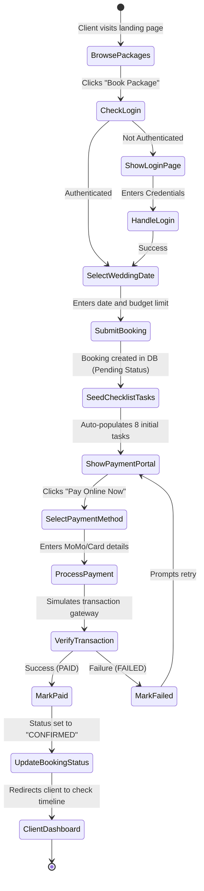
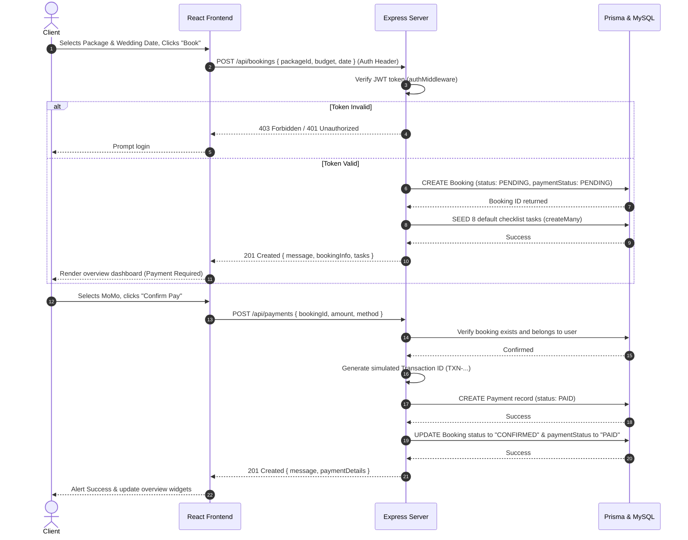
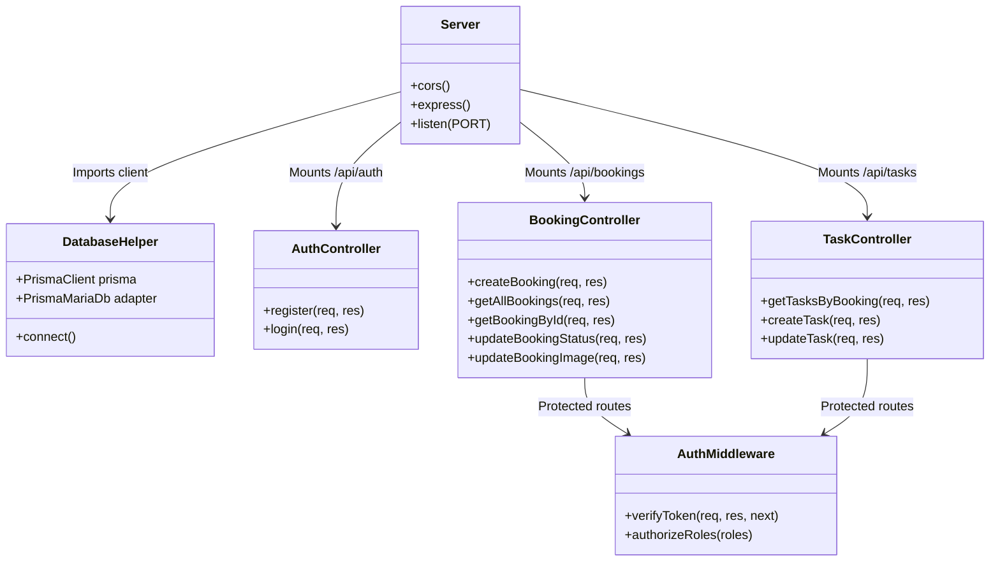
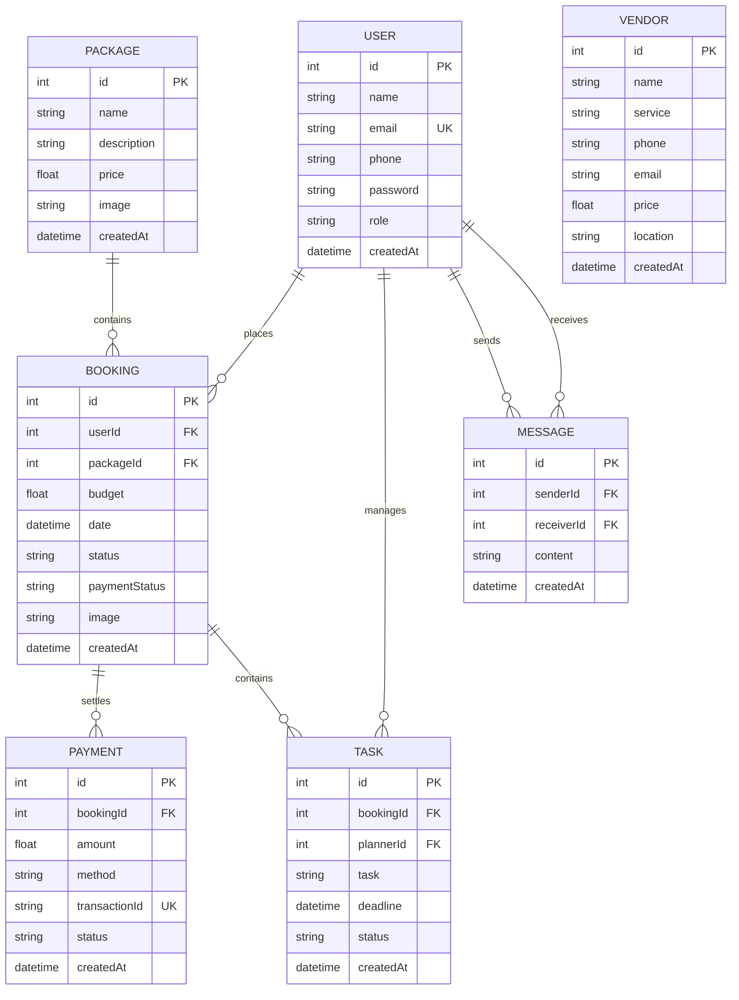

# System UML Diagrams
## Wedding Planner & Budget Management Platform

This document presents the UML and Entity Relationship diagrams representing the architecture and workflows of the Wedding Planner & Budget Management Platform. These diagrams are written using Mermaid notation and can be viewed directly in VS Code's Markdown preview.

---

## 1. Use Case Diagram

The Use Case Diagram displays system boundaries, actors (Client, Planner, Admin), and their interactions with various platform capabilities.

```mermaid
graph TD
    %% Actors
    Client((Client))
    Planner((Planner))
    Admin((Admin))

    %% Use Cases
    subgraph "Authentication & Profile"
        UC_Reg(Register Account)
        UC_Login(Login)
        UC_Profile(Update Profile)
    end

    subgraph "Core Client Operations"
        UC_Budget(Calculate Budget)
        UC_Browse(Browse Packages & Vendors)
        UC_Book(Book Wedding Package)
        UC_Pay(Pay Online - Simulated)
    end

    subgraph "Workflow Management"
        UC_Checklist(Track Wedding Tasks)
        UC_PlannerTasks(Manage Client Tasks)
        UC_Chat(Chat Client <--> Planner)
    end

    subgraph "Administration"
        UC_PkgMgt(Manage Packages CRUD)
        UC_VendorMgt(Manage Vendors CRUD)
        UC_Reports(View Revenue & Analytics Reports)
    end

    %% Relations
    Client --> UC_Reg
    Client --> UC_Login
    Client --> UC_Profile
    Client --> UC_Budget
    Client --> UC_Browse
    Client --> UC_Book
    Client --> UC_Pay
    Client --> UC_Checklist
    Client --> UC_Chat

    Planner --> UC_Login
    Planner --> UC_PlannerTasks
    Planner --> UC_Chat

    Admin --> UC_Login
    Admin --> UC_PkgMgt
    Admin --> UC_VendorMgt
    Admin --> UC_Reports
```

---

## 2. Activity Diagram: Booking & Payment Flow

This diagram traces the procedural flow of a Client booking a package and executing a payment.

---

## 3. Sequence Diagram: Booking Creation & Payment Processing

Traces runtime messages and operations exchanged between the Client, React SPA, Express Backend, Prisma, and MySQL Database.

---

## 4. System Class Diagram

Exposes backend object design, helper configurations, and routes distribution.

---

## 5. Entity Relationship Diagram (ERD)

Exposes the database tables, data types, and primary/foreign key connections.

